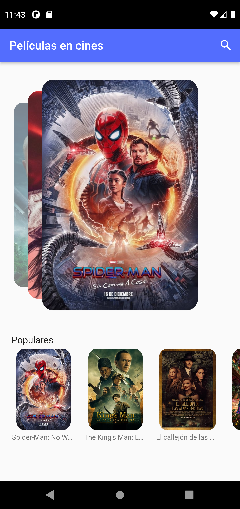
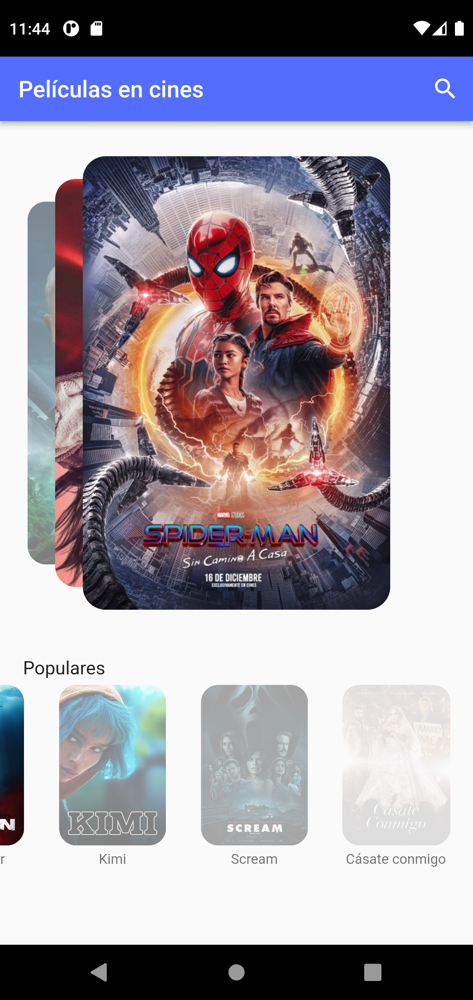
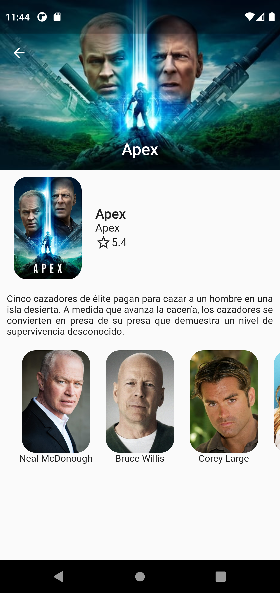
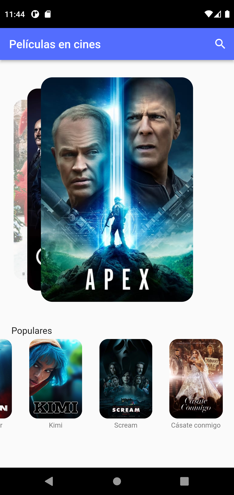

# Movie Flutter APP

Flutter APP Movie usiing api.themoviedb.org API.

## General Info

**Packages used:**

- http: ^0.13.4 [link](https://pub.dev/packages/http)
- flutter_swiper: [link](https://pub.dev/packages/flutter_swiper)

## GIF

## Screenshots

 

